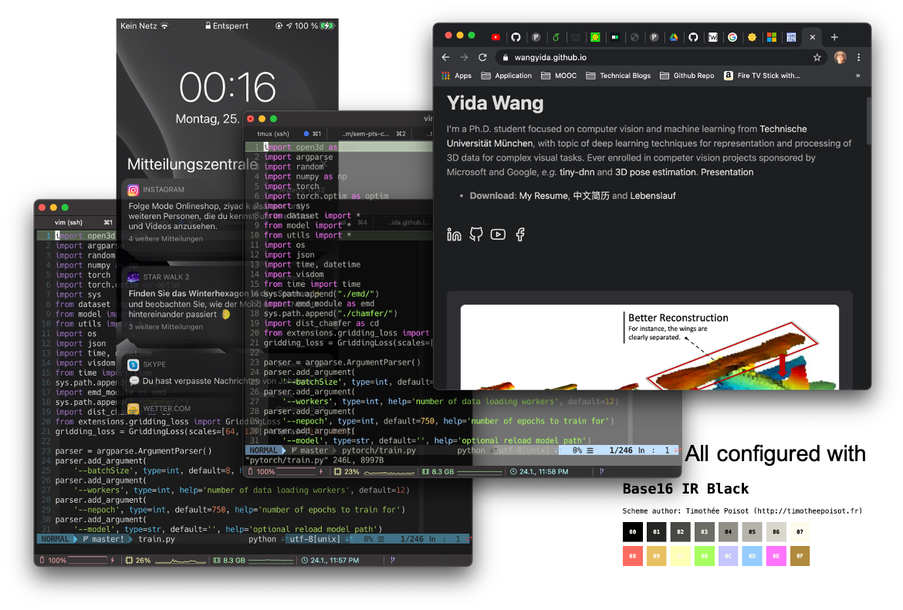
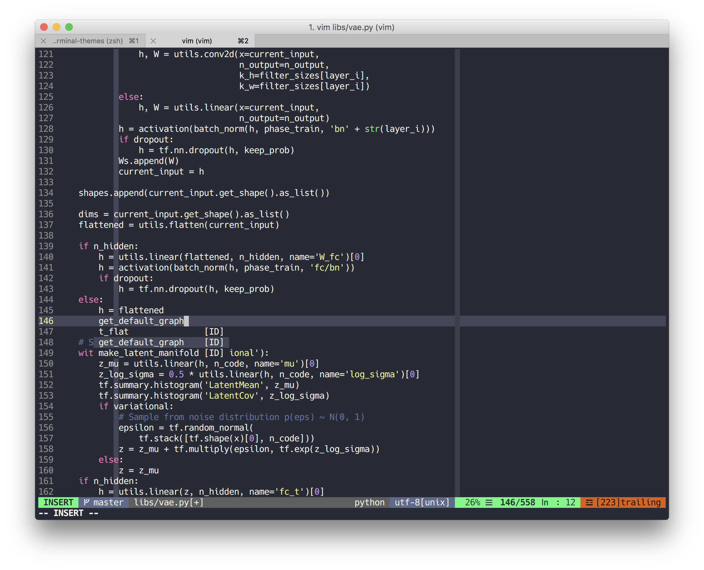
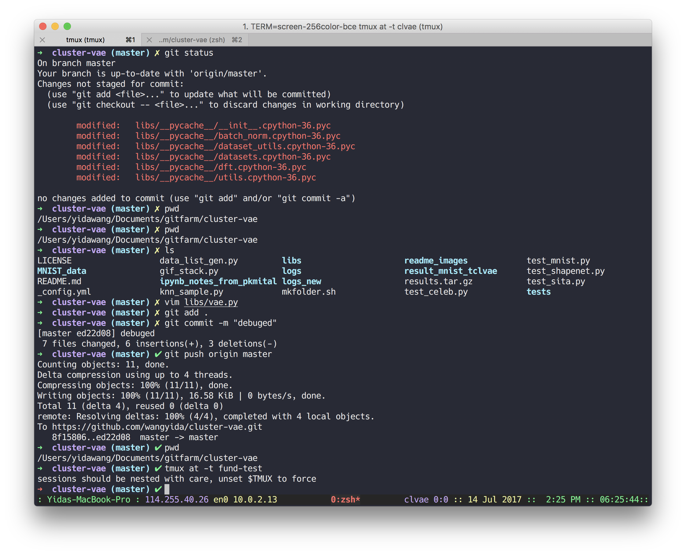
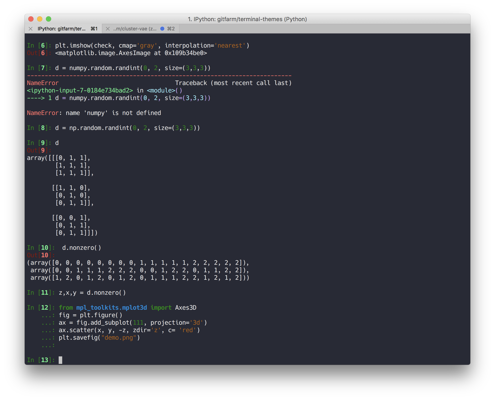
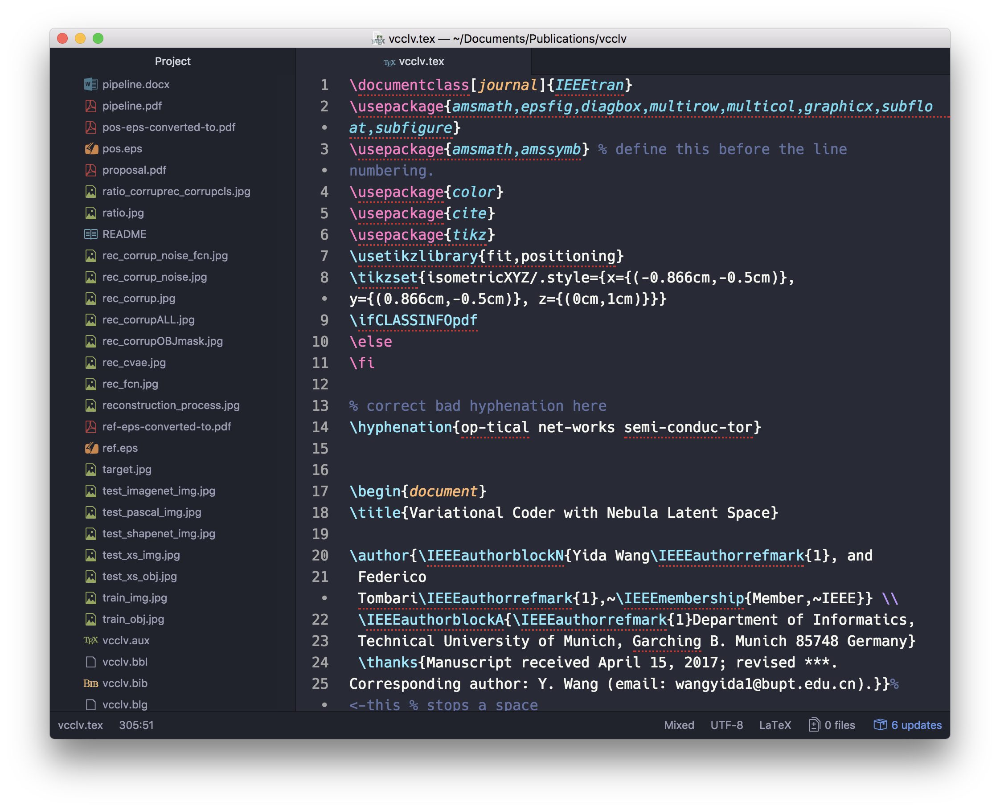

# Terminal Theme Configuration

A dark theme for terminal related panels, especially on Mac, such as vim, shell and tmux.

[Cross-platform dark theme](https://wangyida.github.io/terminal-themes/) authored by [Yida Wang](https://wangyida.github.io/)

**Environments**: Linux/Unix platform



## Installation
Firstly clone this repo
```sh
git clone https://github.com/wangyida/terminal-themes.git
cd terminal-themes
```
For machines which support true color, [Base16 for Shells](https://github.com/chriskempson/base16) could be installed in advance
```sh
git clone https://github.com/chriskempson/base16-shell.git ~/.config/base16-shell
```
Set up [Vundle] for package management of VIM:
```sh
git clone https://github.com/VundleVim/Vundle.vim.git ~/.vim/bundle/Vundle.vim
```
Then both zsh and VIM could be configured with 
```sh
cp ./vimrc ~/.vimrc
source ~/.vimrc
```
To install Plugins, launch `vim` and run `:PluginInstall`

```sh
cp ./zshrc ~/.zshrc
source ~/.zshrc
```
The IR_BLACK theme could be adopted by
```sh
base16_irblack
```

## Font

### A typeface designed for source code

Hack is designed to be a workhorse typeface for code. It has deep roots in the libre, open source typeface community and expands upon the contributions of the [Bitstream Vera](https://www.gnome.org/fonts/) &amp; [DejaVu](http://dejavu-fonts.org/wiki/Main_Page) projects.  The project is in active development.  We welcome your input and contributions.


## Editors

### VIM

Some themes in vim might not be available when the terminal supports true color, but you have not define this in **.vimrc**, In April Vim merged [patch 7.4.1799](https://groups.google.com/forum/#!topic/vim_dev/mAhjlVqpKts), which appears to simplify settings for using true colors in the terminal. After upgrading to this patch, users simply had to include set termguicolors in their vimrc to get true colors in the terminal– the one caveat being that it has to be a terminal like iTerm2 that also supports “true colors”.

You should define this for Iterm:
```sh
" gui colors if running iTerm
if $TERM_PROGRAM =~ "iTerm"
  set termguicolors
endif
```

So vim will be something like this:


It also works well with editing with [YouCompleteMe](https://github.com/Valloric/YouCompleteMe), here is a python version for it.


### Tmux



### iTerm

You should have a test for determing whether the specific terminal like **iTerm** supports true color or not by executing:

```perl
perl test.pl
```
and the results will be something like this:


Here we can use the embeded function 

```sh
imgcat
``` 
in iTerm for perviewing images in terminal.


### ipython 

This theme also works for iPython kernels


### Atom


